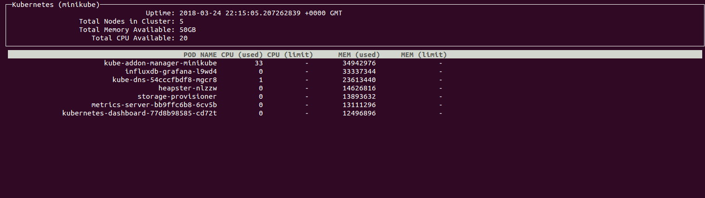

# ktop

A top clone for Kubernetes.  Currently tells you CPU and Memory usage of each
pod in your cluster.  It also tells you how much (if any) CPU & memory each pod
has requested.

## How to use it

There are a number of stand-alone binaries for Linux, Windows & Mac.

Download the correct binary for you system from the
[latest release](../../releases/latest).

## Requirements

You must have the [Metrics Server](https://github.com/kubernetes-incubator/metrics-server)
installed on your cluster.

On the machine you would like to use ktop on you must have a kubeconfig file.
